# FACED

## Results  
### def_data

#### seg_att
lr=0.0005
seg_att=1
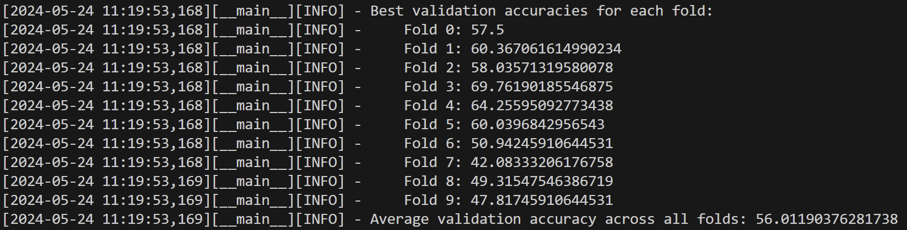
seg_att=2
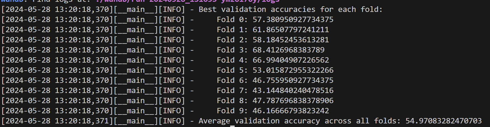
seg_att=3

seg_att=4

seg_att=5
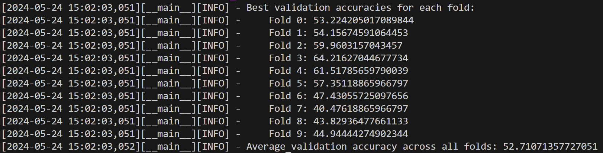

seg_att=7
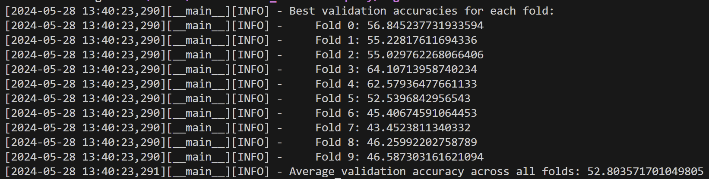

seg_att=10
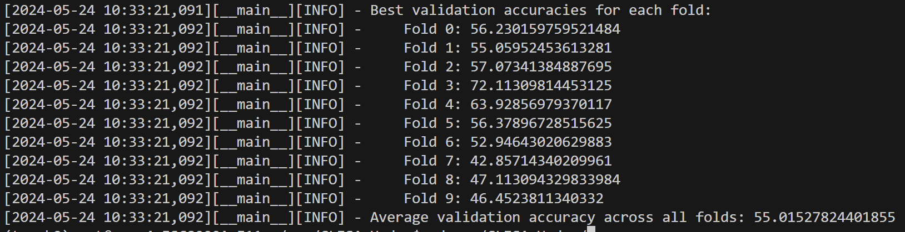

seg_att=15
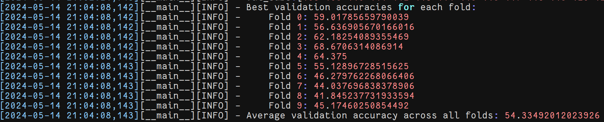

seg_att=20

seg_att=25
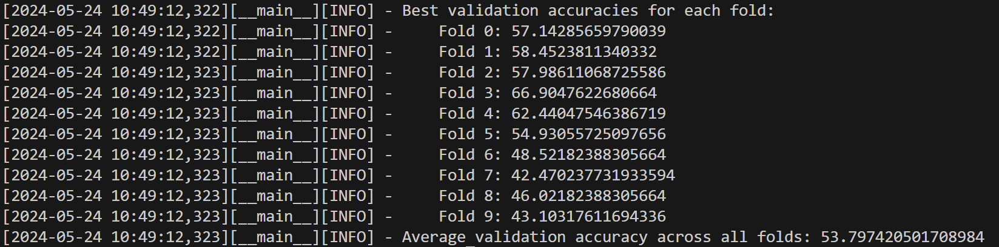

seg_att=30
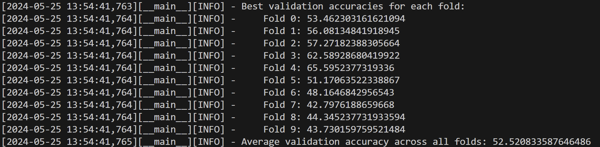

#### mslen
mslen=1
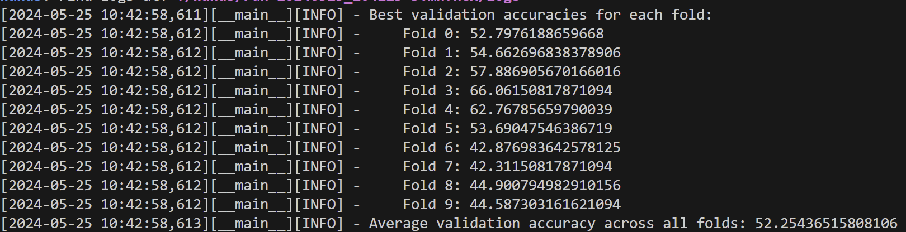

mslen=2
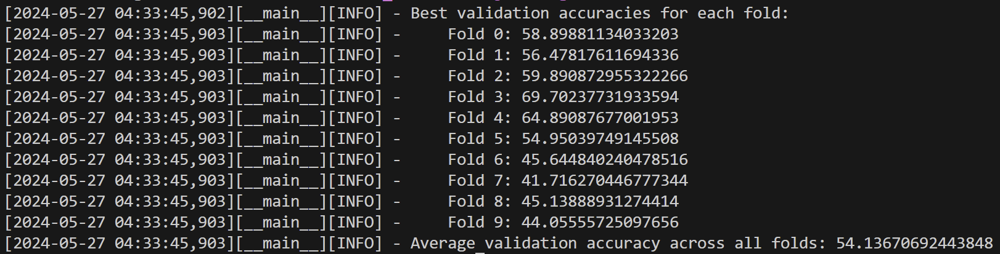
mslen=3
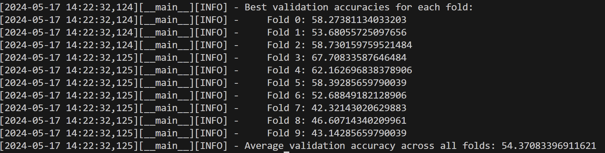
mslen=4
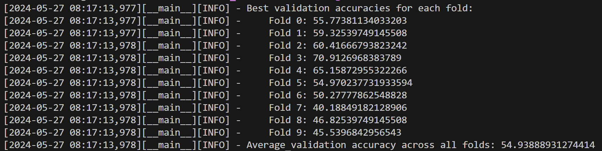
mslen=5
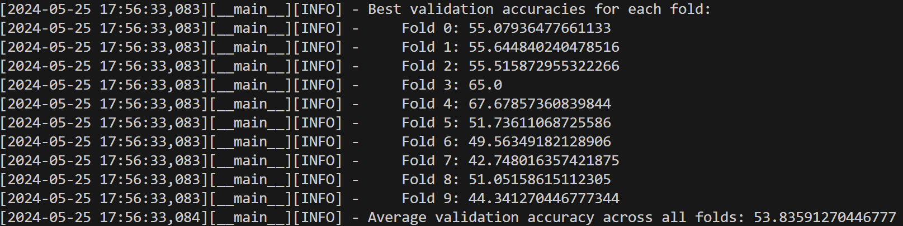
mslen=6

mslen=7
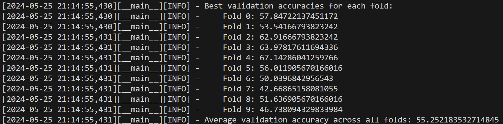

#### wd
0.00015 0.001
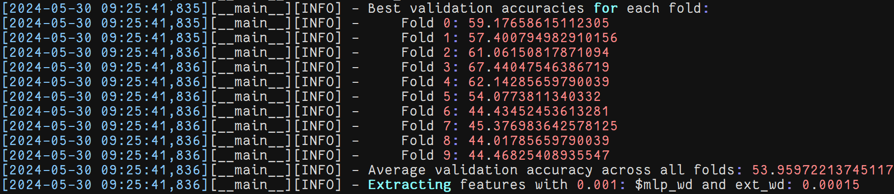

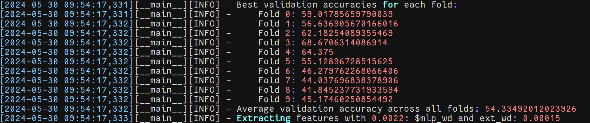

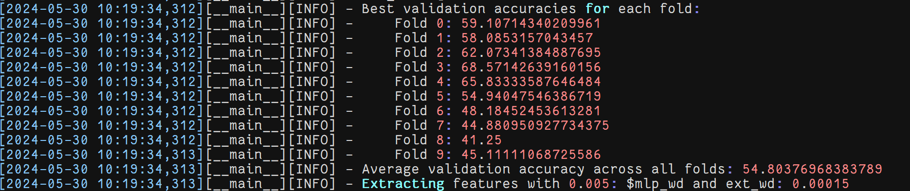

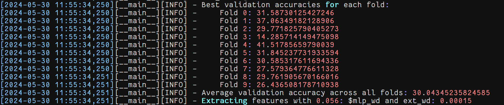

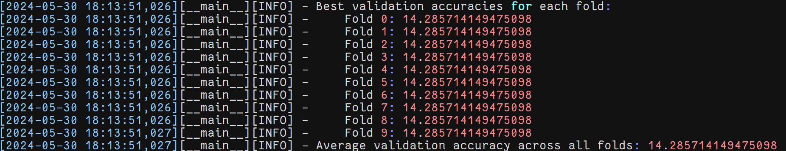

0.0015 0.001
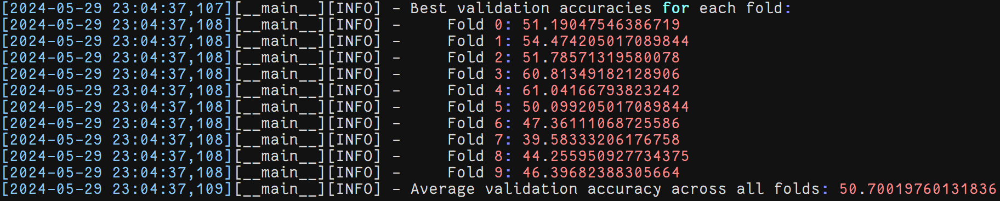
0.0015 0.0022
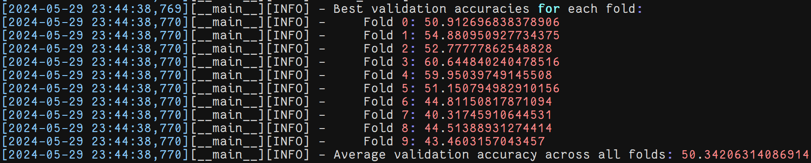
0.0015 0.005
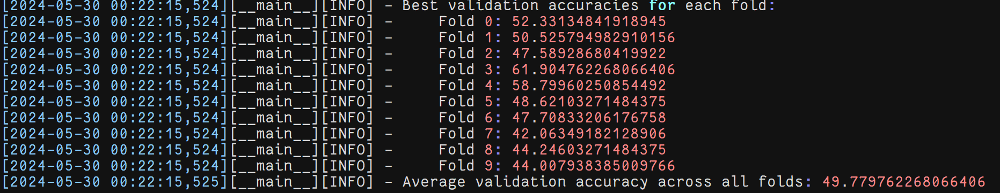
0.0015 0.011
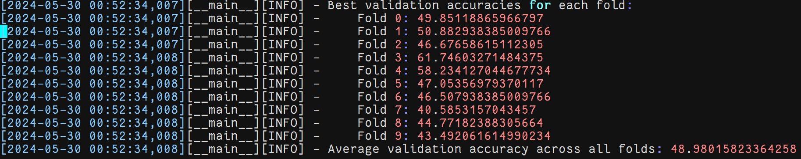
0.0015 0.025
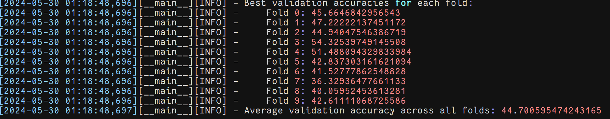
0.0015 0.056
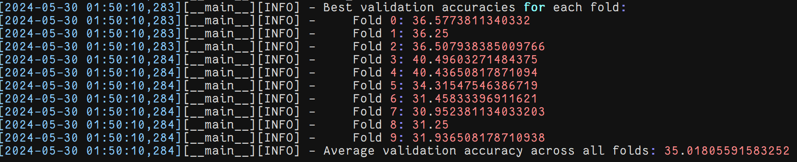
0.0015 0.125
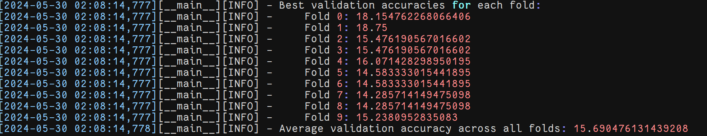

0.015 0.0022
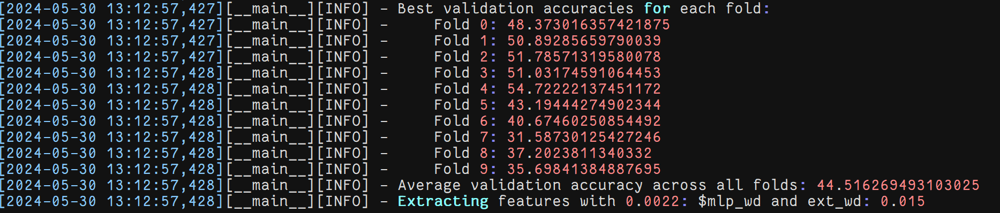

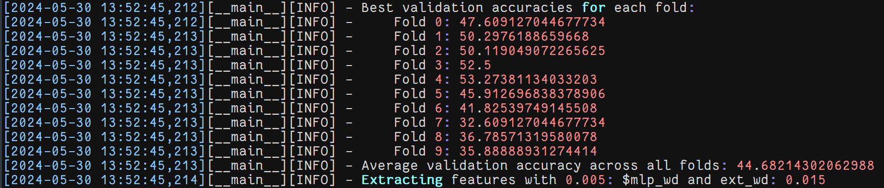

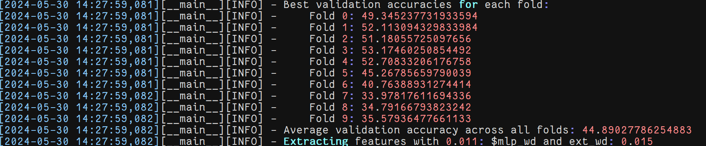

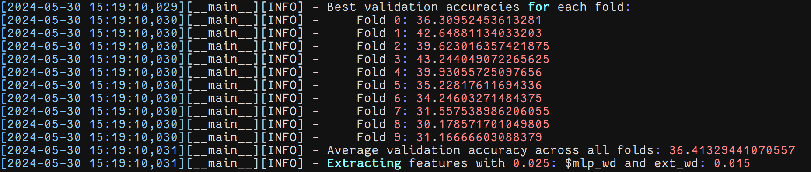

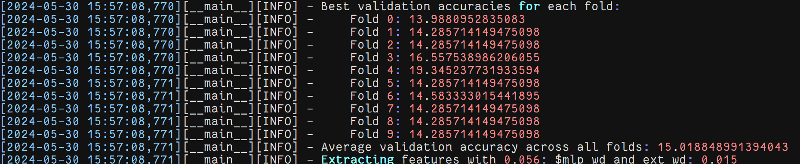

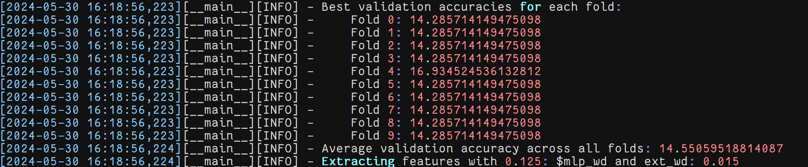

lr=0.00005
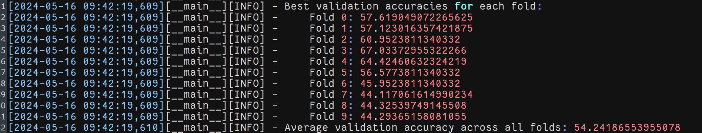

std_model 10 5

### cus_data
std_model

seg_att=20
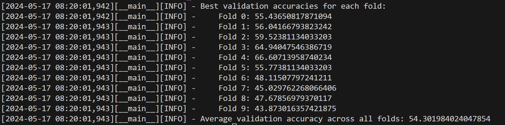

std_model 22 11
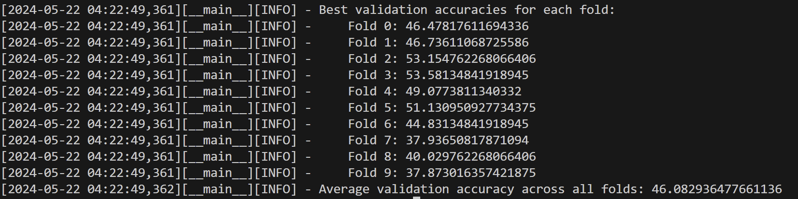

### old_data
std_model 5 2
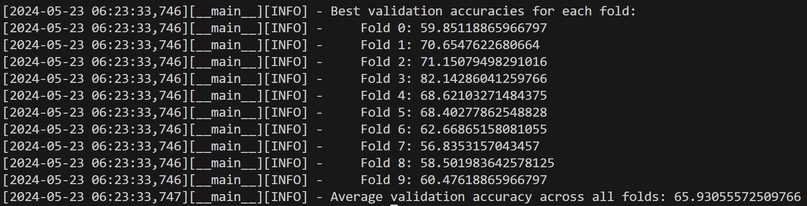

