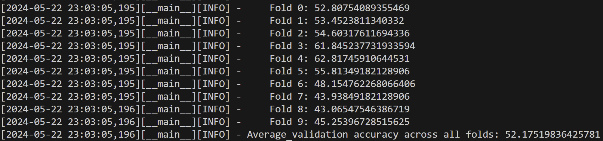

# FACED

## Results  
### def_data

lr=0.0005
seg_att=1

seg_att=5

seg_att=10

seg_att=15

seg_att=20

seg_att=25

lr=0.00005

std_model 10 5

### cus_data
std_model

seg_att=20

std_model 22 11

### old_data
std_model 5 2

