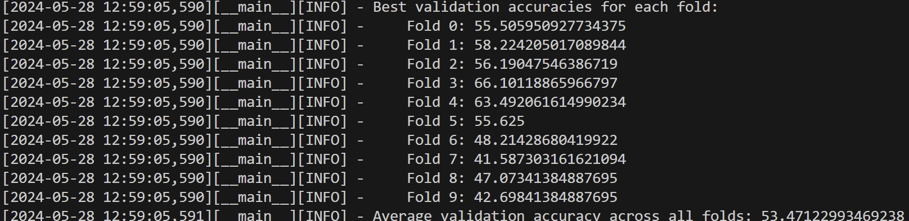
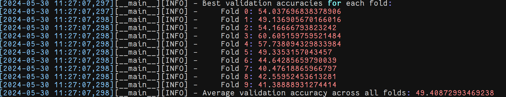
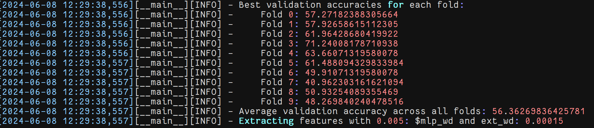
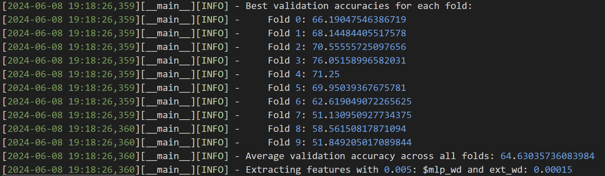
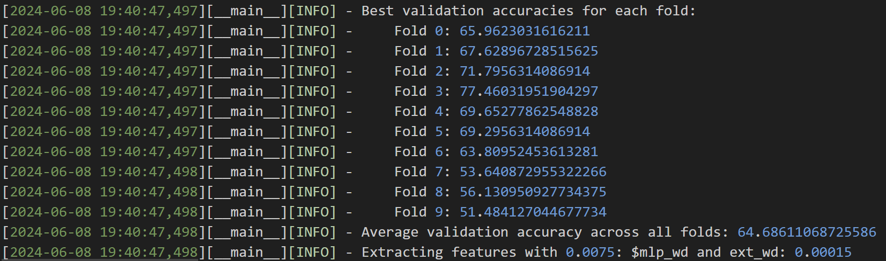

# FACED

## Results  
### def_data

#### seg_att
lr=0.0005
seg_att=1

seg_att=2

seg_att=3

seg_att=4

seg_att=5

seg_att=7

seg_att=10

seg_att=15

seg_att=20

seg_att=25

seg_att=30

#### mslen
mslen=1

mslen=2

mslen=3

mslen=4

mslen=5

mslen=6

mslen=7

#### wd
0.00015 0.001

0.00015 0.0022  pretrain 100/30

dif seed = 2469  不同seed之间很稳定

0.00015 0.005  pretrain 100/30

0.00015 0.011

0.00015 0.025

0.00015 0.056

0.00015 0.125

0.0015 0.001

0.0015 0.0022

0.0015 0.005

0.0015 0.011

0.0015 0.025

0.0015 0.056

0.0015 0.125

0.015 0.001

0.015 0.0022

0.015 0.005

0.015 0.011

0.015 0.025

0.015 0.056

0.015 0.125

lr=0.00005

std_model 10 5

#### ablation
no dilation
15 3

1 6

translayer 
std model 15 3 cross channel no position embedding  4.15 MB

std model 10.06 MB

1layer 7.04 MB

1layer time

direct DE

#### best model
1 3

1 6

### def_c2_data

std_model
0.00015 0.001

0.00015 0.0022

0.00015 0.005

0.00015 0.0075

0.00015 0.011

direct DE

translayer
channel:

time:

1layer time

### def_lessICA_data
15 3

1 6

### def_lessICA_c2
15 3

### cus_data
std_model

seg_att=20

std_model 22 11

### old_data
std_model except seg_att=3 

std_model*2

### old_data_c2
std_model*2

# SEED
## raw data raw code
EPOCH_CHOOSE 1 3 15 [1 3 6 12]

EPOCH_CHOOSE 1 5 24 [1 5 10 19]

EPOCH_CHOOSE 0 3 15 [1 3 6 12]

EPOCH_CHOOSE 0 5 24 [1 5 10 19]

# SEEDV
###
direct DE

# confusion mat
## std model
FACED9

SEEDV 王

SEED 甘

## Direct DE
FACED9

SEEDV

SEED 甘

## no att
FACED9 王

SEEDV 王

SEED 王

