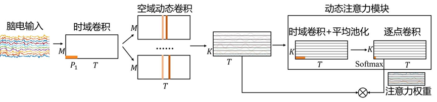
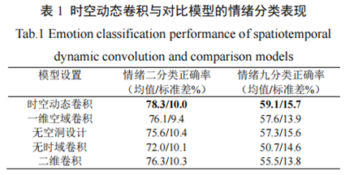

# Dynamic attention-based EEG state transition modelling for emotion recognition
We propose a dynamic attention mechanism for EEG state transition modelling. The model achieved state-of-the-art performance on the FACED dataset and the SEED dataset. The model learns interpretable spatiotemporal representations and state transitions in EEG signals. The model may serve as a basic backbone for EEG modelling.

## Introduction
The importance of state transition in EEG analysis. Its implications for EEG-based emotion recognition.

## Methods
Figure 1. The architecture of the model
显示隐层表征的示意。

 

## Experiments
Preprocessing
统一成现在的pipeline（和原来的CLISA相比略有差别。原来CLISA的插值坏导和ICA的顺序应该反过来）

Table 1. Hyperparameters

Table 2. Cross-subject performance on the FACED dataset (binary, nine-class).
对比CLISA, a transformer-based architecture, PR-PL, RGNN
(The comparison should highlight the strength of the architecture)

Table 3. Cross-subject performance on the SEED/SEEDV dataset std model.
对比CLISA, a transformer-based architecture, PR-PL, RGNN
2 weeks

Table 4. Variations of the attention design.
Without attention, with global channel attention, different activation functions, substitute with a transformer layer
FACED9 is ok

Table 5. Variations of the convolution design.
 
Should report the results with dynamic attention. Should add the results of the SEED dataset.

Figure 2. Confusion matrices of the model

Figure 3 & 4. Analysis of the important temporal and spatial patterns on the two datasets.

Figure 5. Analysis of the dynamic attention patterns.

Figure 6. Variation of the convolutional kernel size and pooling size in the attention module
FACED9 is ok

## Steps:
1.	完成统一预处理（庆翥）
2.	在预处理数据上验证完整模型效果（用润民的代码和我的代码都跑一下）（润民、新科）
3.	做Table 4的实验（润民，恺璇）
4.	分析时空模式和注意力模式（新科）
5.	完成Table 5的实验和Figure 6的实验（润民 恺璇）
6.	完成PR-PL和RGNN在FACED上的对比实验（新科、庆翥）
7.  self-attention based model remain to be down （next week later） Table3 Table4

seed 3 分类
空洞size
ablation
一维空域
二维卷积

SeedV 新数据
FACED 数据

