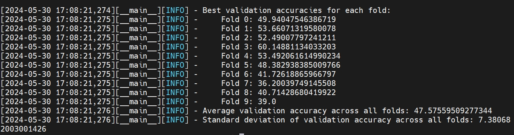

# FACED-ablation

## Results

#### data: FACED_new

global_att=true

activ = 'relu'

has_att = False, ext_fea.mode='de'

has_att = False, ext_fea.mode='me'

# FACED-variations of convolution design

| 类型         | 类别 | 值         |
| ------------ | ---- | ---------- |
| 一维空域卷积 | 9    | 52.25/8.00 |
| 无空洞设计   | 9    | 53.58/8.95 |
| 无时域卷积   | 9    | 52.20/8.11 |
| 二维卷积     | 9    | 55.72/8.56 |
| 一维空域卷积 | 2    | 72.98/4.17 |
| 无空洞设计   | 2    | 71.91/5.33 |
| 无时域卷积   | 2    | 73.99/4.65 |
| 二维卷积     | 2    | 72.24/4.02 |

一维空域卷积，9分类；*mslen=1

无空洞设计，9分类；*dilation=[1,1,1,1]

无时域卷积，9分类

二维卷积，9分类

一维空域卷积，2分类

无空洞设计，2分类

无时域卷积，2分类

二维卷积，2分类

